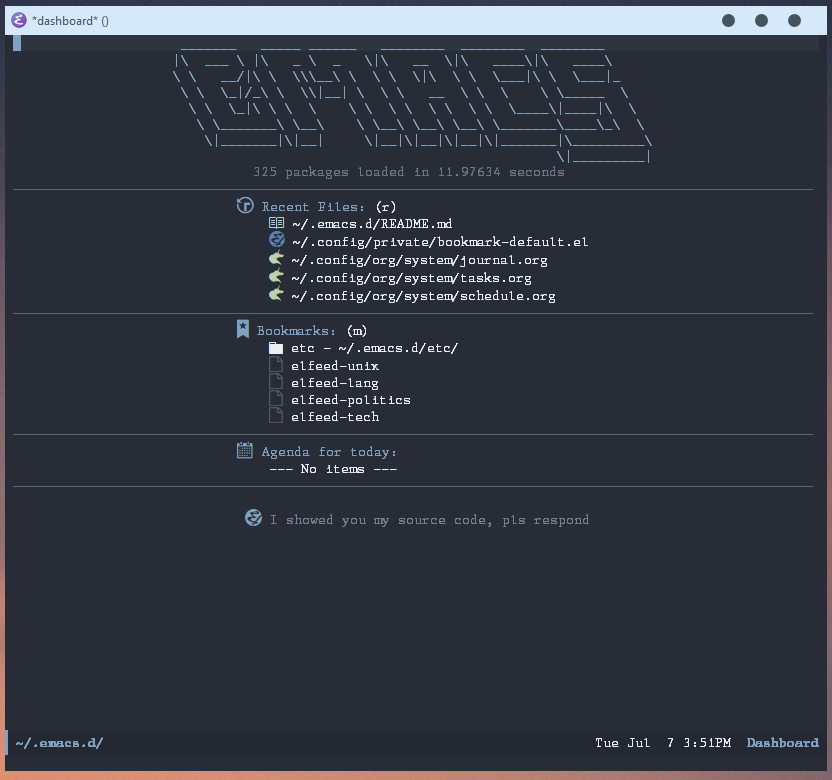

# .emacs.d
GNU Emacs configuration files for PDF, org-mode,
autocompletion (company), IRC (ERC), and much more.  

I use Emacs for everything except browsing the web.
& Email (ProtonMail).

# Windows (win32)
Because of necessity (work), my config works with win32. It probably won't work
as-is with a unix system. Moreover, references to 'private/<>' files would need
to be removed if you try to copy your config on mine. 

## Server and keybindings
I use autohotkey and powershell scripts to start emacs at login, and to open new
emacsclient. You will find scripts in the windows directory of var.

## General recommandations
If you need to use Windows with Emacs, here are my recommandations for what it's
worth:
  * Use [scoop](https://scoop.sh/) to install Emacs, msys2, coreutils, etc.
  * Add [kiennq scoop bucket](https://github.com/kiennq/scoop-misc) to install
    emacs-snapshot for version 28.
  * If you have admin rights on your machine, install the following to increase
    privacy and stop Microsoft from doing too much neferious stuff:
    * [W10Privacy](https://www.w10privacy.de/english-home/), GUI tool to change
      multiple settings and registries. Documentation in German.
    * [Setup script for new Windows 10](https://github.com/Disassembler0/Win10-Initial-Setup-Script)
  
# Screenshot

