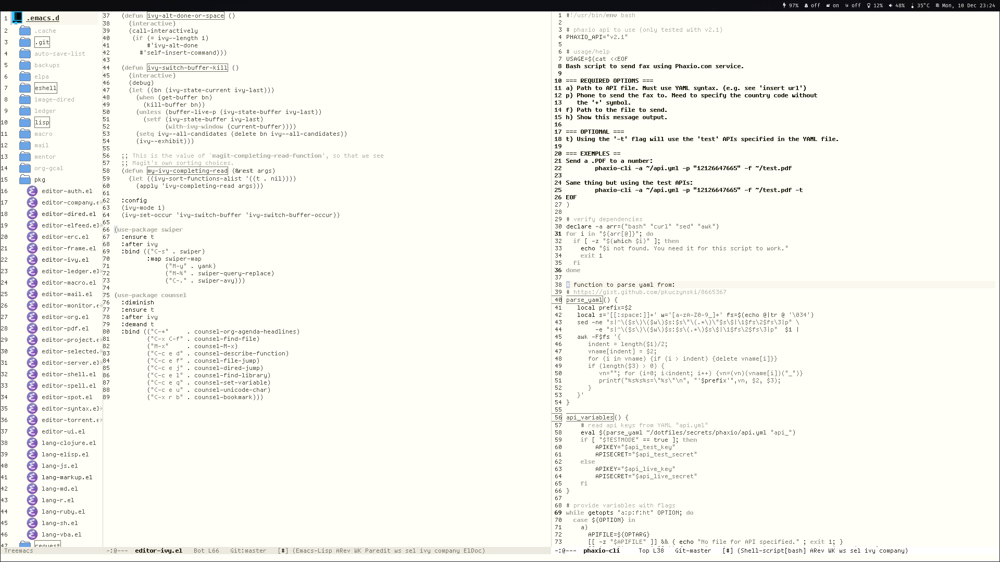

# .emacs.d
GNU Emacs configuration files for PDF, org-mode, email (mu4e), 
autocompletion (company), IRC (ERC), and much more.  

I use Emacs for everything except browsing the web. Here is a picture of my
setup:

